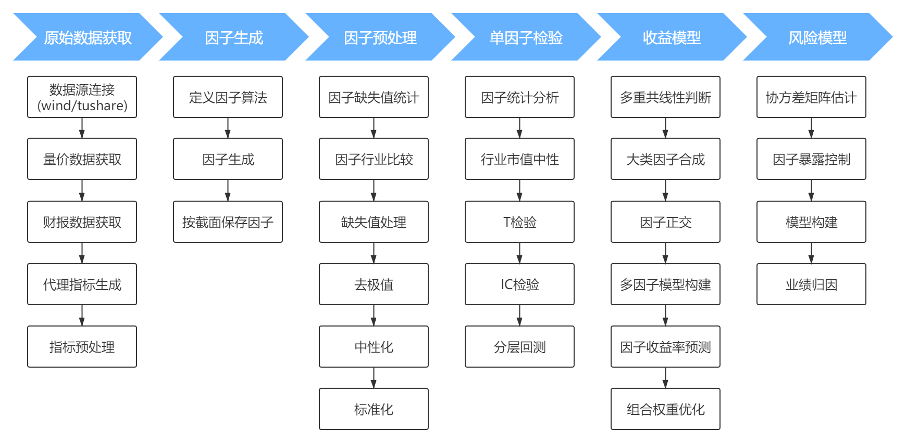

# Alpha收割：对沪深300的多因子指数增强和回测

## 模型简介

本模型针对沪深300成分股，选取估值因子、动量因子、流动性因子、成长因子、作为**阿尔法因子**，选取波动率因子、市值因子、 Beta 因子和行业因子作为**风险因子**，采用月2频方式调仓，根据历史月频横截面回归计算因子收益率，并在每个月末根据最新的因子暴露预测下个月全部指数成分股收益，并通过风险模型以最大化组合的预测收益为目标，同时控制组合相对基准指数的行业及市值暴露，实现对组合中个股的权重优化，以**沪深300增强**为例，每个月通过模型从300只成分股中选出约60-100只个股，以最优权重构建组合。 回测周期为 2014 年 1 月 - 2019 年 12 月。模型采用 24 个月指数加权方式预测 T+1 期因 子收益率，并进行市值中性化和行业中性化处理。经过回测，模型年化超额收益8.3%，并**在2014-2019年期间每一年都跑赢指数**，详见《**指数增强策略研究报告**》。

## 模型结构

包括原始数据获取、因子生成、因子数据预处理、单因子检验、收益预测模型及风险模型等，具体流程如图：

## 代码框架

1.原始数据获取.py：原始数据获取主文件；

2.raw_data_fetch.py：原始数据获取功能文件，用于从tushare数据源获取原始数据，数据以指标名作为文件名保存到一个个文件中。

3.因子生成.py：因子生成主文件；

4.factor_generate.py：因子生成功能文件，用于通过对原始数据的计算生成相应各种因子，以截面形式保存到文件。

5.因子预处理.py：因子预处理主文件；

6.factor_preprocess.py：因子预处理功能文件，用于对计算后的原始因子数据进行预处理，包括缺失值处理、中位数法去极值、标准化及相对行业和市值中性化处理。

7.单因子检验.py：单因子检验主文件；

8.single_factor_test.py：单因子检验功能文件，用于对标准化后的单因子进行回归IC法检验、分层回测法检验，对有效因子进行初步筛选。

9.指数增强模型.py：指数增强模型运行主文件；

10.index_enhance.py：指数增强模型功能文件，用于对有效单因子进行因子合成与正交，进行收益预测，并通过风险模型进行权重优化，最终生成回测结果。

## 参考项目

### 多因子分析及预测
- https://github.com/phonegapX/alphasickle
- https://github.com/JoshuaWu1997/EMD-ALSTM-Multi-Factor-Stock-Profit-Prediction (x)

### 机器学习预测（不涉及因子）
- https://github.com/LightingFx/hs300_stock_predict
- https://github.com/moyuweiqing/A-stock-prediction-algorithm-based-on-machine-learning
